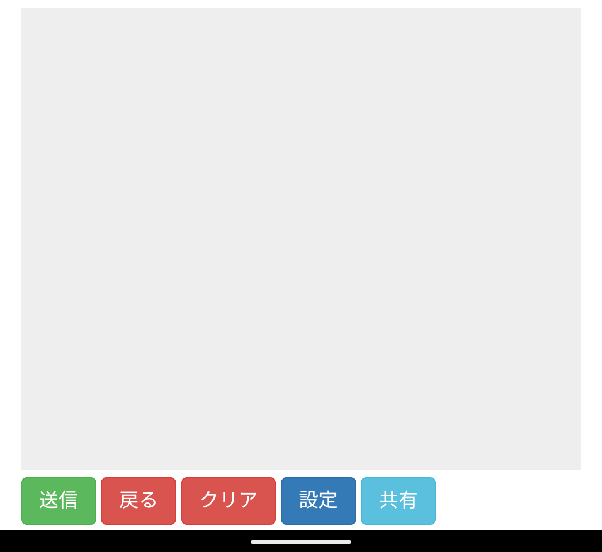

# liff-canvas

[](https://repl.it/github/HRTK92/liff-canvas}&ref=button)

Python 3.8

## インストール
```sh
pip install -r requirements.txt
```

## 使い方
```python
python main.py
```

## 設定について
ペンの太さや色、バックカラーを選べます。


